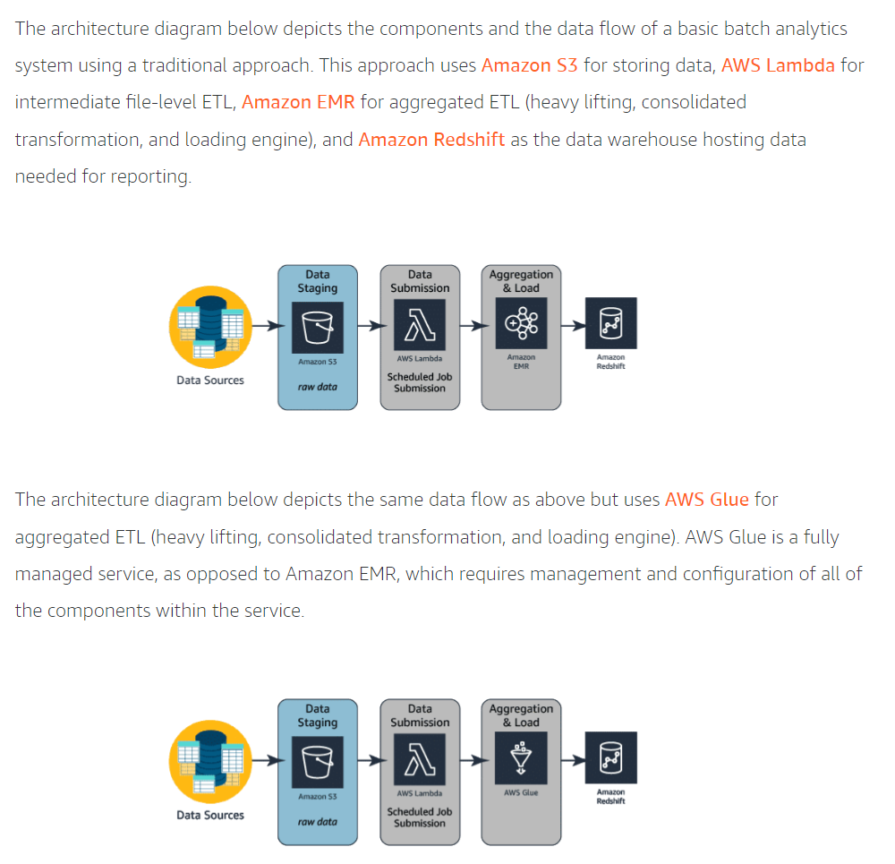

## Data Analytics Fundamental (ID: E-XVD4P0)
Date: 6/5/2022
Course available on: AWS Skills Builder
Certification: Data Analytics Specialty
Link: [Course](https://explore.skillbuilder.aws/learn/course/44/Data%2520Analytics%2520Fundamentals)

### Volume

Key service: Amazon S3 ("Simple Storage Service")

- S3 stores data as objects within buckets
- One S3 can have many buckets
- One bucket can have many objects
- Buckets are logical containers, can give access control to individual bucket, view access logs
- Object is a file and any metadata associated with the file, permission can be set at this level
- An object has a key. Each object is accessed by bucket+key (prefix)+object (version) such as http://**doc**.s3.amazonaws.com/**2006-03-01**/**AmazonS3.html**
- Key idea is to "decouple storage from processing"
- Allows many writes and many reads at the same time

#### Data Lake
- "A data lake is a centralized repository that allows you to store structured, semistructured, and unstructured data at any scale."
- benefits are 1) single source of truth 2) store any type of data regardless of structure and 3) can use AI and ML to analyze
- one issue to bear in mind is security
- "Setting up and managing data lakes today can involve a lot of manual, complicated, and time-consuming tasks. This work includes loading the data, monitoring the data flows, setting up partitions for the data, and tuning encryption. You may also need to reorganize data, deduplicate it, match linked records, and audit data over time."
- Problem: scattering files all over the place (on-prem, cloud) --> S3 as data lake
- Problem: has millions of files in S3, how to organize and ingest? --> Amazon Lake Formation ("Lake Formation gives you a central console where you can discover data sources, set up transformation jobs to move data to an Amazon S3 data lake, remove duplicates and match records, catalog data for access by analytic tools, configure data access and security policies, and audit and control access from AWS analytic and machine learning services. AWS Lake Formation is a service that organizes and curates data within Amazon S3 data lakes. This service ensures the security and compliance of items within the lake as well as orchestrates transformation jobs utilizing the data lake and other AWS services")

#### Data Lakes vs Data Warehouses vs Data marts
- "A data warehouse is a central repository of information coming from one or more data sources. Data flows into a data warehouse from transactional systems, relational databases, and other sources. These data sources can include structured, semistructured, and unstructured data. These data sources are transformed into structured data before they are stored in the data warehouse."
- Since data are transformed into structured data, data warehouse needs a schema which defines how data is stored within tables, columns, and rows. The schema enforces constraints on the data to ensure integrity of the data. The transformation process often involves the steps required to make the source data conform to the schema.
- Amazon's service for data warehouse is Amazon Redshift
- "Data mart is a subset of data from a data warehouse. Data marts only focus on one subject or functional area. A warehouse might contain all relevant sources for an enterprise, but a data mart might store only a single department’s sources. Because data marts are generally a copy of data already contained in a data warehouse, they are often fast and simple to implement."
- The main drawbacks of data warehouse are costly to implement, challenging implementation, security concerns, and hard to scale.
- When storing individual objects or files, we recommend Amazon S3.
- When storing massive volumes of data, both semistructured and unstructured, we recommend building a data lake on Amazon S3.
- When storing massive amounts of structured data for complex analysis, we recommend storing your data in Amazon Redshift.

#### Hadoop, Amazon EMR, and Amazon Glue
- "Hadoop uses a distributed processing architecture, in which a task is mapped to a cluster of commodity servers for processing. Each piece of work distributed to the cluster servers can be run or re-run on any of the servers. The cluster servers frequently use the Hadoop Distributed File System (HDFS) to store data locally for processing. The results of the computation performed by those servers are then reduced to a single output set. One node, designated as the master node, controls the distribution of tasks and can automatically handle server failures."
- Hadoop is open source
- Amazon EMR implements Hadoop framework. EMR handles (1) HDFS and Elastic MapReduce File System (EMRFS)
- An Amazon EMR process begins by ingesting data from one or more data sources and storing that data within a file system. If using HDFS, the file system is stored as an elastic block store volume. This storage volume is ephemeral meaning that the storage is of a temporary nature. Once the data has been copied into the HDFS volume, the transformation and analysis of the data is performed. The results are then sent to an analytical data store, such as an Amazon S3 data lake or Amazon Redshift data warehouse."
- "Amazon EMR provides an alternative to HDFS: the EMR File System (EMRFS). EMRFS can help ensure that there is a persistent "source of truth" for HDFS data stored in Amazon S3. When implementing EMRFS, there is no need to copy data into the cluster before transforming and analyzing the data as with HDFS. EMRFS can catalog data within a data lake on Amazon S3. The time that is saved by eliminating the copy step can dramatically improve performance of the cluster."

### Velocity

#### Data processing methods
1. Batch processing
    1.1 scheduled
    1.2 periodic
2. Stream processing
    2.1 near real-time: concerns a lot about velocity
    2.2 real-time: velocity is paramount

#### Data acceleration
- is the rate at which large collections of data can be ingested, processed, and analyzed
- example: Take Twitter as an example. Hashtags can become hugely popular and appear hundreds of times in just seconds, or slow down to one tag an hour.

#### Batch data processing
- "is the execution of a series of programs, or jobs, on one or more computers without manual intervention. Data is collected into batches asynchronously. The batch is sent to a processing system when specific conditions are met, such as a specified time of day. The results of the processing job are then sent to a storage location that can be queried later as needed."
- Can use Amazon EMR and Hadoop
- "Apache Hadoop is a scalable storage and batch data processing system. It uses commodity server hardware and provides fault tolerance through software. Hadoop complements existing data systems by simultaneously ingesting and processing large volumes of data, structured or not, from any number of sources, which enables deeper analysis than any one system can provide. These results can be delivered to any existing enterprise system for further use independent of Hadoop."
- batch processing architecture. 2 options
    1.1 Traditional approach: data > raw data storage (S3) > data submission scheduled job submission (AWS lambda) > aggregation and load (Amazon EMR) > Warehousing (Amazon Redshift)
    1.2 Alternative approach (using Glue): data > raw data storage (S3) > data submission scheduled job submission (AWS lambda) > aggregation and load (Amazon Glue) > Warehousing (Amazon Redshift)

{width=50%}

### Variety

### Veracity

### Value
